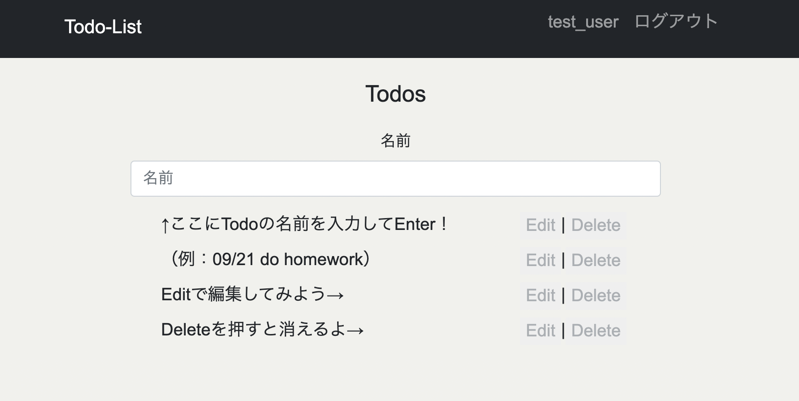

# django-todo

# 目的
- 以前PHPで作ったTodoアプリをDjangoでリプレイスすることで、
  Webアプリ開発とフレームワークDjangoの理解を深めることを目的として制作しました。
  

# 実際のアプリ→[django-todo](https://django-todo-app-yahomi.herokuapp.com/)

  

## 使用方法
  - 左上の新規登録からユーザー登録をしたのちにログイン
  - トップのフォームに登録したいTodoを入力し、Enter
  - EditやDeleteは各Todoの右にある文字をクリックすることで実行できます
    - Deleteは押すと削除されるので気をつけてください

# 使用した技術
  - Python-3.9.5
  - Django-3.2.3
  - SQLite3
  - Heroku
  - Git
